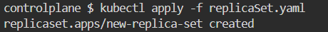
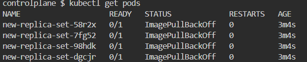
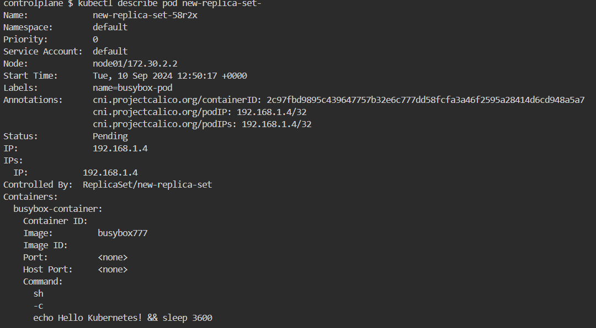
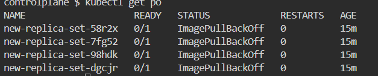
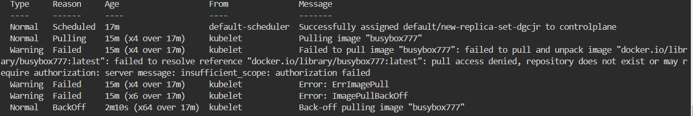
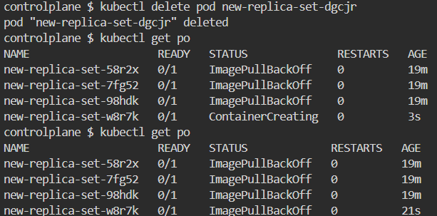
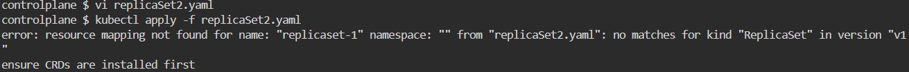
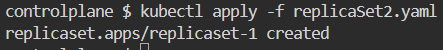

# k8s-lab2
1. the created replicaSet : 

2. the number of pods in the replicaSet :
    

3. the image used to create the replicaSet is busybox777 :
    

4. the number of ready images is 0 :
    

5. the pods is not ready because the images does not exist :
    

6. the number of available pods is 4  :
    

7. the number of available pods is also 4 because the down one is created again by the controller 

8. the file does not created :
 
 after adding : apiVersion: apps/v1 the file created 
 
